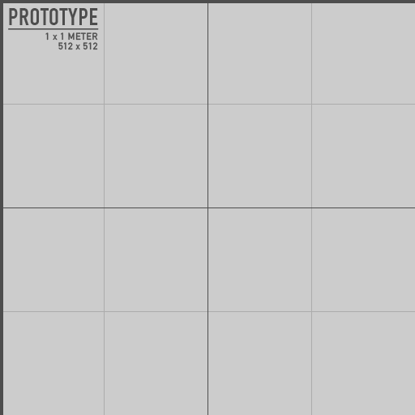

# **Unity Renderer**


## **Overview**

The `ParseWorldState` script is a Unity component designed to load and visualize the state of a physics simulation from a JSON file. It parses a sequence of world states, each containing information about bodies and constraints, and creates corresponding GameObjects in Unity to represent these elements. This script is particularly useful for visualizing physics simulations or other dynamic systems described by JSON data.

## **Features**

- **JSON Parsing**: Reads a JSON file containing world states and converts them into Unity GameObjects.
- **Dynamic Visualization**: Supports various primitive shapes like boxes, spheres, capsules, and cylinders to represent different bodies in the simulation.
- **Constraint Handling**: Visualizes constraints between bodies using spherical markers and draws lines between connected bodies.
- **Custom Materials**: Applies HDRP materials with customizable normal and albedo maps to the bodies and constraints for better visualization.
- **Frame Control**: Allows control over the simulation frame rate using a configurable `deltaTime` parameter.
- **Reset Functionality**: Easily reset and reload the simulation using a key press.

## **Installation**

1. **Add Script to Unity Project**:
    - Copy the `ParseWorldState` script into your Unity project's `Assets/Scripts` directory.
    - Attach the `ParseWorldState` script to a GameObject in your Unity scene.
2. **Prepare JSON File**
    - Ensure that the JSON file describing the world states is accessible from your Unity environment.
    - Update the file path in the script to point to your JSON file location.
3. **Configure Materials**:
    - Set the `bodyMaterial` and `constraintMaterial` fields in the Unity Inspector to your desired URP materials.
    - Optionally, assign textures to `normalMap` and `albedoMap` fields for enhanced visual effects.

??? abstract "Here are the normal map and albedo map that I used."
    {: style="height:150px;width:150px"}
    {: style="height:150px;width:150px"}

## **Usage**

### JSON File Structure

The JSON file must follow a specific structure to be parsed correctly by the script:


??? example "World_States.json"
    !!! warning ""
        The AOP Lua Module's `World:GetStates()` will output the world states in this format.

    ```json
    {
      "worldStates": [
        {
          "bodies": [
            {
              "id": 1,
              "motion_type": "dynamic",
              "position": [0.0, 1.0, 0.0],
              "radius": 1.0,
              "height": 2.0,
              "shape": "Capsule",
              "size": [1.0, 2.0, 1.0],
              "rotation": [0.0, 0.0, 0.0, 1.0],
              "data": ""
            }
          ],
          "constraints": [
            {
              "id": 1,
              "body1ID": 1,
              "body2ID": 2,
              "type": "fixed",
              "space": 0,
              "point1": [0.0, 1.0, 0.0],
              "point2": [1.0, 1.0, 0.0]
            }
          ]
        }
      ]
    }
    ```

### Script Parameters

- **deltaTime**: Controls the delay between frames. Adjust this to control the speed of the simulation.
- **normalMap**: Texture to be applied as a normal map to the body materials.
- **albedoMap**: Texture to be applied as an albedo map to the body materials.
- **bodyMaterial**: Base material used for the bodies.
- **constraintMaterial**: Base material used for the constraints.

### Running the Simulation

1. **Start the Simulation**:
    - The simulation begins automatically when the scene is played.
    - The script parses the JSON file, creating and positioning the GameObjects based on the data.

2. **Resetting the Simulation**:
    - Press the `Space` key to clear the current simulation and reload it from the JSON file.

### Customization

- **Shapes**: Extend the `CreateGameObject` method to add more primitive shapes or custom models.
- **Materials**: Modify the `SetupBodyMaterial` method to further customize the appearance of bodies using additional material properties.

## **Conclusion**

The `ParseWorldState` script is a powerful tool for visualizing complex simulations described in JSON format within Unity. It allows for dynamic and customizable visualization, making it ideal for a variety of simulation-based projects.

## **Resources**

??? example "ParseWorldState.cs"
    ```csharp linenums="1"

    using System.Collections;
    using System.Collections.Generic;
    using UnityEngine;
    using System.IO;

    [System.Serializable]
    public class WorldState
    {
        public List<Body> bodies;
        public List<Constraint> constraints;
    }

    [System.Serializable]
    public class Body
    {
        public int id;
        public string motion_type;
        public float[] position;
        public float radius;
        public float height;
        public string shape;
        public float[] size;
        public float[] rotation;
        public string data;
    }

    [System.Serializable]
    public class Constraint
    {
        public int id;
        public int body1ID;
        public int body2ID;
        public string type;
        public int space;
        public float[] point1;
        public float[] point2;
        public GameObject point1_obj;
        public GameObject point2_obj;
    }

    [System.Serializable]
    public class Root
    {
        public List<WorldState> worldStates;
    }

    public class ParseWorldState : MonoBehaviour
    {
        public float deltaTime;

        public Texture2D normalMap;
        public Texture2D albedoMap;

        public Material bodyMaterial;
        public Material constraintMaterial;

        private Dictionary<int, Constraint> constraints = new Dictionary<int, Constraint>();
        private Dictionary<int, GameObject> bodies = new Dictionary<int, GameObject>();

        // List of colors to use for materials
        private readonly List<Color> colors = new List<Color>
        {
            new Color(0.4f, 0.4f, 0.4f),
            new Color(1.0f, 0.0f, 0.0f),
            new Color(0.0f, 1.0f, 0.0f),
            new Color(0.0f, 0.0f, 1.0f),
            new Color(1.0f, 1.0f, 0.0f),
            new Color(1.0f, 0.0f, 1.0f),
            new Color(0.0f, 1.0f, 1.0f),
            new Color(1.0f, 1.0f, 1.0f),
            new Color(0.5f, 0.5f, 0.5f),
            new Color(0.5f, 0.5f, 0.0f)
        };

        // Coroutine to parse and display the world states
        private IEnumerator Start()
        {
            int frame = 0;

            // Read and parse the JSON file
            string jsonString = File.ReadAllText("[[ file of the worldstates json ]]");
            Root root = JsonUtility.FromJson<Root>(jsonString);

            // Iterate through each world state in the JSON
            foreach (var worldState in root.worldStates)
            {
                // Handle each body in the world state
                foreach (Body body in worldState.bodies)
                {
                    GameObject obj = null;

                    if (!bodies.ContainsKey(body.id))
                    {
                        // Create a GameObject based on the shape type
                        obj = CreateGameObject(body);

                        // Set up the material for the body
                        SetupBodyMaterial(obj, body);

                        // Add the body to the dictionary
                        bodies.Add(body.id, obj);
                    }
                    else
                    {
                        // Retrieve the existing GameObject
                        obj = bodies[body.id];
                    }

                    // Update the transform and scale of the GameObject
                    UpdateTransform(obj, body);
                }

                // Destroy any bodies that are no longer present in the world state
                DestroyAbsentBodies(worldState);

                // Handle each constraint in the world state
                foreach (Constraint constraint in worldState.constraints)
                {
                    if (!constraints.ContainsKey(constraint.id))
                    {
                        // Create GameObjects for the constraint points
                        SetupConstraintPoints(constraint);

                        // Add the constraint to the dictionary
                        constraints.Add(constraint.id, constraint);
                    }
                }

                // Increment the frame count and wait for the next update
                frame++;
                yield return new WaitForSeconds(frame == 1 ? 2 : deltaTime);
            }

            yield return null;
        }

        // Creates a GameObject based on the body's shape
        private GameObject CreateGameObject(Body body)
        {
            GameObject obj = body.shape switch
            {
                "Box" => GameObject.CreatePrimitive(PrimitiveType.Cube),
                "Sphere" => GameObject.CreatePrimitive(PrimitiveType.Sphere),
                "Capsule" => GameObject.CreatePrimitive(PrimitiveType.Capsule),
                "Cylinder" => GameObject.CreatePrimitive(PrimitiveType.Cylinder),
                _ => null
            };

            return obj;
        }

        // Sets up the material for the body GameObject
        private void SetupBodyMaterial(GameObject obj, Body body)
        {
            Material material = new Material(bodyMaterial)
            {
                mainTextureScale = new Vector2(body.size[0], body.size[2])
            };

            material.SetTexture("_BaseColorMap", albedoMap);
            material.SetTexture("_NormalMap", normalMap);

            // Assign a color from the predefined list
            Color color = colors[bodies.Count % colors.Count];
            material.SetColor("_BaseColor", color);

            obj.GetComponent<MeshRenderer>().material = material;
        }

        // Updates the position, rotation, and scale of the body GameObject
        private void UpdateTransform(GameObject obj, Body body)
        {
            obj.transform.SetPositionAndRotation(
                new Vector3(body.position[0], body.position[1], body.position[2]),
                new Quaternion(body.rotation[0], body.rotation[1], body.rotation[2], body.rotation[3])
            );

            if (body.shape == "Capsule" || body.shape == "Cylinder")
            {
                obj.transform.localScale = new Vector3(body.radius * 2, body.height * 0.5f, body.radius * 2);
            }
            else
            {
                obj.transform.localScale = new Vector3(body.size[0], body.size[1], body.size[2]);
            }
        }

        // Destroys bodies that are not present in the current world state
        private void DestroyAbsentBodies(WorldState worldState)
        {
            List<int> toDestroy = new List<int>();

            foreach (int id in bodies.Keys)
            {
                if (worldState.bodies.Find(x => x.id == id) == null)
                {
                    toDestroy.Add(id);
                }
            }

            foreach (int id in toDestroy)
            {
                Destroy(bodies[id]);
                bodies.Remove(id);
            }
        }

        // Sets up the constraint points as GameObjects
        private void SetupConstraintPoints(Constraint constraint)
        {
            constraint.point1_obj = CreateConstraintPoint();
            constraint.point2_obj = CreateConstraintPoint();

            if (constraint.space == 0 || constraint.space == 1)
            {
                constraint.point1_obj.transform.parent = bodies[constraint.body1ID].transform;
                constraint.point2_obj.transform.parent = bodies[constraint.body2ID].transform;
            }

            constraint.point1_obj.transform.position = new Vector3(constraint.point1[0], constraint.point1[1], constraint.point1[2]);
            constraint.point2_obj.transform.position = new Vector3(constraint.point2[0], constraint.point2[1], constraint.point2[2]);
        }

        // Creates a spherical GameObject for a constraint point
        private GameObject CreateConstraintPoint()
        {
            GameObject pointObj = GameObject.CreatePrimitive(PrimitiveType.Sphere);
            Material material = new Material(constraintMaterial);
            pointObj.GetComponent<MeshRenderer>().material = material;
            pointObj.transform.localScale = new Vector3(0.35f, 0.35f, 0.35f);
            return pointObj;
        }

        // Update is called once per frame
        private void Update()
        {
            // Draws lines between the constraint points
            foreach (Constraint constraint in constraints.Values)
            {
                GameObject obj1 = bodies[constraint.body1ID];
                GameObject obj2 = bodies[constraint.body2ID];

                Debug.DrawLine(obj1.transform.position, obj2.transform.position, Color.green);
            }

            // Resets the simulation on space key press
            if (Input.GetKeyDown(KeyCode.Space))
            {
                ResetSimulation();
            }
        }

        // Resets the simulation by clearing bodies and constraints
        private void ResetSimulation()
        {
            constraints.Clear();

            foreach (GameObject obj in bodies.Values)
            {
                Destroy(obj);
            }

            foreach (Constraint constraint in constraints.Values)
            {
                Destroy(constraint.point1_obj);
                Destroy(constraint.point2_obj);
            }

            bodies.Clear();
            StopAllCoroutines();
            StartCoroutine(Start());
        }
    }
    ```
